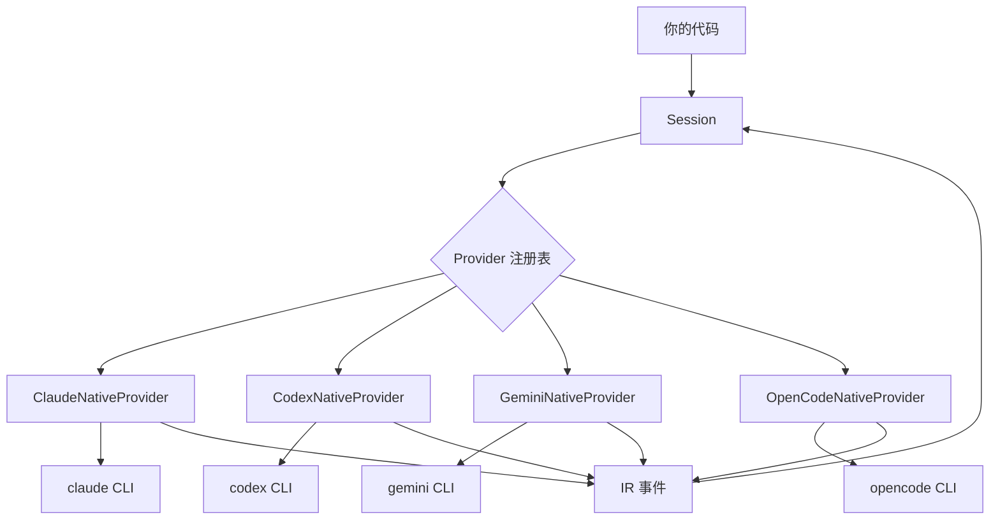

# 架构设计

## 设计概览

agentabi 采用分层架构，包含三个核心概念：

1. **Session** — 面向消费者的 API
2. **Provider** — 每个 agent 的适配层
3. **IR（中间表示）** — 通用事件格式



## Provider 模型

### Provider 协议

每个 provider 实现一个通用协议，包含四个方法：

- `is_available()` — 此 provider 是否可用？
- `capabilities()` — 支持哪些功能？
- `stream(task)` — 执行并逐个产出 IR 事件
- `run(task)` — 执行并返回汇总结果

### Provider 类型

**Native Provider** 将 agent CLI 作为子进程运行，解析其结构化输出（JSON/JSONL）为 IR 事件。不需要额外 Python 依赖。

**SDK Provider** 使用 agent 的官方 Python SDK。提供更紧密的集成，但需要安装可选依赖。

### 回退链

每个 agent 有一个有序的 provider 列表。注册表按顺序尝试：

```
claude_code → [ClaudeNativeProvider, ClaudeSDKProvider]
codex       → [CodexNativeProvider, CodexSDKProvider]
gemini_cli  → [GeminiNativeProvider, GeminiSDKProvider]
opencode    → [OpenCodeNativeProvider]
```

如果 native provider 可用（CLI 在 PATH 中），优先使用。否则尝试 SDK provider。

## 中间表示（IR）

IR 是一组 TypedDict 事件类型，将所有 agent 的输出归一化为通用格式。灵感来自编译器 IR（如 LLVM IR）— 每个 agent 的原生事件格式被"编译"为 IR 事件。

### 设计原则

1. **能力并集** — IR 支持所有 agent 的所有功能。Agent 特有的字段设为可选。
2. **TypedDict 而非 dataclass** — 事件是普通字典，便于序列化且零开销。
3. **判别联合** — 每个事件都有 `type` 字段用于模式匹配。
4. **增量演进** — 可以添加新的事件类型和可选字段而不破坏现有消费者。

### 事件分类

| 类别 | 事件 | 用途 |
|-----|------|------|
| 会话生命周期 | `session_start`, `session_end` | 会话边界 |
| 消息流 | `message_start`, `message_delta`, `message_end` | 文本流式输出 |
| 工具执行 | `tool_use`, `tool_result` | 工具调用追踪 |
| 元数据 | `usage`, `error`, `file_diff` | 统计和诊断 |
| 权限 | `permission_request`, `permission_response` | 审批流程 |

## 项目结构

```
src/agentabi/
├── __init__.py          # 公开 API 导出
├── session.py           # Session 类 + run_sync()
├── auto_detect.py       # Agent 发现
├── providers/
│   ├── base.py          # Provider 协议 + default_run()
│   ├── registry.py      # Provider 链注册表
│   ├── claude_native.py # Claude 子进程 provider
│   ├── claude_sdk.py    # Claude SDK provider
│   ├── codex_native.py  # Codex 子进程 provider
│   ├── codex_sdk.py     # Codex SDK provider
│   ├── gemini_native.py # Gemini 子进程 provider
│   ├── gemini_sdk.py    # Gemini SDK provider
│   └── opencode_native.py # OpenCode 子进程 provider
└── types/
    └── ir/
        ├── events.py       # IR 事件 TypedDict
        ├── session.py      # SessionResult
        ├── task.py          # TaskConfig
        ├── capabilities.py # AgentCapabilities
        ├── permissions.py  # 权限类型
        ├── helpers.py      # 事件创建辅助函数
        └── type_guards.py  # 运行时类型守卫
```
