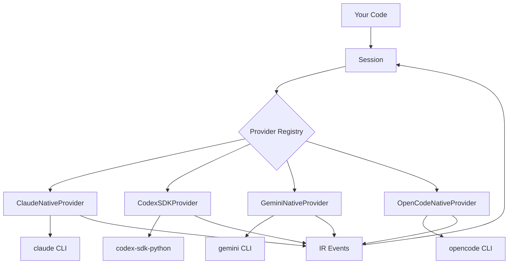

# Architecture

## Design Overview

agentabi follows a layered architecture with three key concepts:

1. **Session** — The consumer-facing API
2. **Provider** — The adapter layer for each agent
3. **IR (Intermediate Representation)** — The common event format



## Provider Model

### Provider Protocol

Every provider implements a common protocol with four methods:

- `is_available()` — Can this provider be used?
- `capabilities()` — What features does it support?
- `stream(task)` — Execute and yield IR events
- `run(task)` — Execute and return aggregated result

### Provider Types

**Native Providers** run the agent CLI as a subprocess, parsing its structured output (JSON/JSONL) into IR events. They have zero extra Python dependencies.

**SDK Providers** use the agent's official Python SDK. They provide tighter integration but require installing optional dependencies.

### Fallback Chains

Each agent has an ordered list of providers. The registry tries each in order:

```
claude_code → [ClaudeNativeProvider, ClaudeSDKProvider]
codex       → [CodexSDKProvider]
gemini_cli  → [GeminiNativeProvider, GeminiSDKProvider]
opencode    → [OpenCodeNativeProvider]
```

If a native provider is available (CLI in PATH), it is preferred. If not, the SDK provider is tried.

## Intermediate Representation (IR)

The IR is a set of TypedDict event types that normalize all agent output into a common format. This is inspired by compiler IRs (like LLVM IR) — each agent's native event format is "compiled" into IR events.

### Design Principles

1. **Union of capabilities** — The IR supports all features from all agents. Agent-specific fields are optional.
2. **TypedDict over dataclass** — Events are plain dictionaries for easy serialization and zero overhead.
3. **Discriminated union** — Every event has a `type` field for pattern matching.
4. **Additive evolution** — New event types and optional fields can be added without breaking existing consumers.

### Event Categories

| Category | Events | Purpose |
|----------|--------|---------|
| Session lifecycle | `session_start`, `session_end` | Session boundaries |
| Message flow | `message_start`, `message_delta`, `message_end` | Text streaming |
| Tool execution | `tool_use`, `tool_result` | Tool call tracking |
| Metadata | `usage`, `error`, `file_diff` | Stats and diagnostics |
| Permissions | `permission_request`, `permission_response` | Approval flow |

## Project Structure

```
src/agentabi/
├── __init__.py          # Public API exports
├── session.py           # Session class + run_sync()
├── auto_detect.py       # Agent discovery
├── providers/
│   ├── base.py          # Provider protocol + default_run()
│   ├── registry.py      # Provider chain registry
│   ├── claude_native.py # Claude subprocess provider
│   ├── claude_sdk.py    # Claude SDK provider
│   ├── codex_sdk.py     # Codex SDK provider
│   ├── gemini_native.py # Gemini subprocess provider
│   ├── gemini_sdk.py    # Gemini SDK provider
│   └── opencode_native.py # OpenCode subprocess provider
└── types/
    └── ir/
        ├── events.py       # IR event TypedDicts
        ├── session.py      # SessionResult
        ├── task.py          # TaskConfig
        ├── capabilities.py # AgentCapabilities
        ├── permissions.py  # Permission types
        ├── helpers.py      # Event creation helpers
        └── type_guards.py  # Runtime type guards
```
